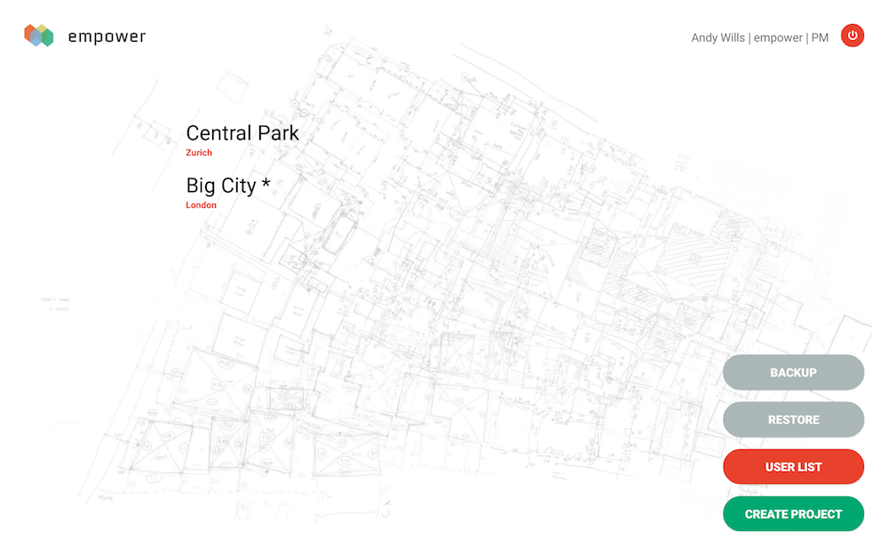
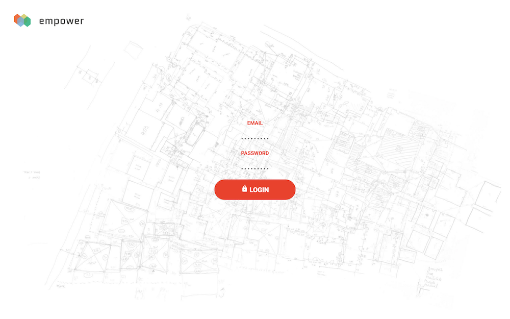

<h1>Urban Design Empower Shack Project</h1>

Empower is an Android tablet application and a digital platform using an innovative approach to generate urban layout scenarios informed by residents. It was developed by Jinbox in the context of the Empower Shack project directed by <a href="http://u-tt.com/project/empower-shack/">Urban ThinkTank</a> in collaboration with the BT-Section community and associated local and international partners. It offers an easy and complete interface to address all steps of the process such as micro financing, contract signatures, and data-collection in coordination with central office. It has been tested in the field in Cape Town. It won numerious awards such as the Best Practice Award for Participatory Slum Upgrading organised by UN Habitat.

<h2>Application Screenshots</h2>
<table>
  <tr>
    <td valign="top"></td>
    <td valign="top"></td>
  </tr>
  <tr>
    <td valign="top"></td>
    <td valign="top"></td>
  </tr>
  <tr>
    <td valign="top"></td>
    <td valign="top"></td>
  </tr>
  <tr>
    <td valign="top"></td>
    <td valign="top"></td>
  </tr>
</table>
<h2>Project Design</h2>
<table>
  <tr>
    <td valign="top"></td>
    <td valign="top"></td>
    <td valign="top"></td>
  </tr>
  <tr>
    <td valign="top"></td>
    <td valign="top"></td>
    <td valign="top"></td>
</tr>
</table>
